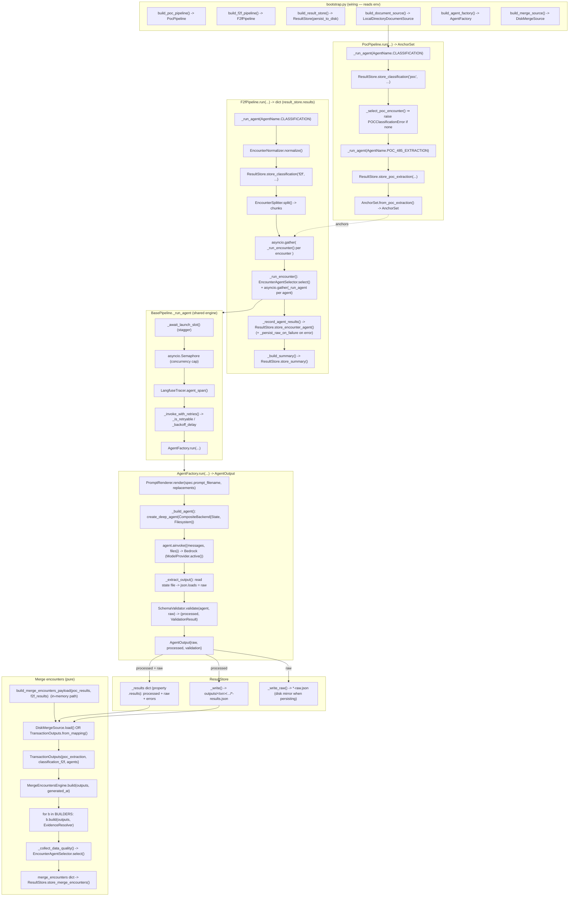
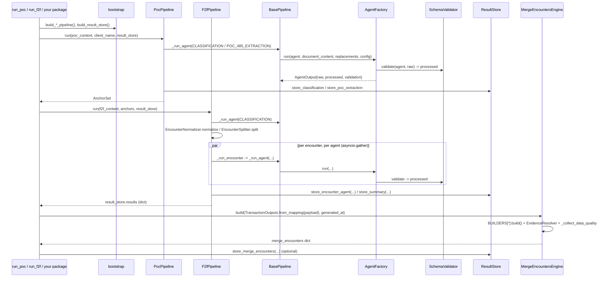

# F2F Audit Workflow — Code-Level Flow

End-to-end flow of the current codebase: how data enters, how agents process it,
how raw is converted to processed `*-results.json`, and how the consolidated
`merge_encounters` is assembled. Class and method names match the source.

## 1. Class-level call flow

## 2. Sequence (who calls whom)

## 3. Key classes and their one job

| Class | File | Responsibility |
|---|---|---|
| `bootstrap` (module) | `bootstrap.py` | Reads env, constructs everything (the only env reader) |
| `PocPipeline` | `pipelines/poc_pipeline.py` | classify POC -> gate -> extract -> `AnchorSet` |
| `F2fPipeline` | `pipelines/f2f_pipeline.py` | classify F2F -> normalize -> split -> parallel agents -> summary |
| `BasePipeline` | `pipelines/base_pipeline.py` | `_run_agent`: semaphore cap, launch stagger, retry/backoff, tracing |
| `AgentFactory` | `agents/agent_factory.py` | build+invoke deep agent, `json.loads`=raw, validate=processed -> `AgentOutput` |
| `SchemaValidator` | `core/output_validator.py` | raw -> normalized/repaired processed + `ValidationResult` |
| `EncounterAgentSelector` | `core/detection.py` | pick which agents run for an encounter |
| `EncounterNormalizer` / `EncounterSplitter` | `core/` | repair page lines / cut per-encounter chunks |
| `AnchorSet` | `core/anchors.py` | the 5 POC placeholders injected into F2F prompts |
| `ResultStore` | `core/result_store.py` | in-memory `_results` (processed) + disk `*-results.json` / `*-raw.json` |
| `TransactionOutputs` | `merge_encounters/transaction_outputs.py` | normalize outputs — `from_disk` or `from_mapping` |
| `MergeEncountersEngine` | `merge_encounters/merge_engine.py` | pure: `BUILDERS` + `EvidenceResolver` + `data_quality` -> `merge_encounters` |
| `DiskMergeSource` | `merge_encounters/merge_source.py` | batch loader wrapping `TransactionOutputs.from_disk` |

## 4. The two conversions

| Conversion | Where | Result |
|---|---|---|
| raw -> results.json | `AgentFactory._extract_output` (`SchemaValidator.validate`) | `raw` (verbatim) + `processed` (normalized `-results.json`) |
| results.json -> merge_encounters | `MergeEncountersEngine.build` via `TransactionOutputs` | consolidated `merge-encounters/results.json` (topics + inline evidence + data_quality) |

Note: `AgentOutput` holds both `raw` and `processed`. After `ResultStore.store_*`
runs, `result_store.results` keeps **processed + raw + errors** in memory (raw is
also mirrored to `*-raw.json` on disk when persisting). The merge engine consumes
the processed outputs only.
