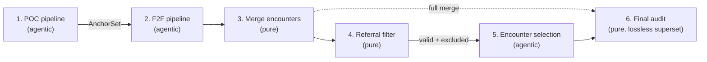

# e5-f2f-audit

Face-to-Face (F2F) / Plan-of-Care (POC) home-health audit agent orchestration.

The distribution is **`e5-f2f-audit`**; the import package is **`e5_f2f_audit`**
(src-layout under `src/`). It orchestrates a set of DeepAgents (POC/485 extraction,
document classification, and seven per-encounter F2F agents) plus deterministic
consolidation, filtering, encounter selection, and a final audit — end-to-end traceable
with Langfuse.

The codebase splits into two clean layers:

- **Pure primitives** — deterministic, I/O-free, env-free transforms (`MergeEncountersEngine`,
  `filter_candidates`, `FinalAuditEngine`, `TransactionOutputs`). Safe to run anywhere,
  including a Temporal activity.
- **Agentic pipelines** — the LLM pipelines (POC, F2F, Selection), constructed from an
  injected `OrchestrationConfig` (no environment required).

Bundled `prompts/` and `skills/` ship **inside** the package, so an installed wheel is
self-contained — the agentic layer finds its prompts/skills without a source checkout.

---

## Architecture at a glance

Six stages, run in order (POC → F2F are agentic and mandatory; the last four are optional):



| Stage | Entry point | Kind | Output |
|---|---|---|---|
| 1. POC | `build_poc_pipeline(config).run(...)` | agentic (async) | `AnchorSet` (+ `poc_store.results`) |
| 2. F2F | `build_f2f_pipeline(config).run(...)` | agentic (async) | per-encounter results dict |
| 3. Merge | `MergeEncountersEngine().build(...)` | pure | `merge_encounters` dict |
| 4. Filter | `filter_candidates(merge, roster)` | pure | `(valid_candidates, excluded_encounters)` |
| 5. Selection | `build_selection_pipeline(config).run(..., soc_date=...)` | agentic (async) | `AgentOutput` (best encounter) |
| 6. Final audit | `build_final_audit_engine().build(full_merge, selection, ...)` | pure | `audit` dict (all encounters + selection headline) |

> Final Audit consumes the **full** merge (stage 3), not the filtered set — it is a
> lossless superset: every encounter retained, with the selection headline fields
> prefixed onto `results`.

The seven per-encounter F2F agents are `encounter-identity`, `primary-diagnosis`,
`skilled-services`, `homebound`, `inpatient-detection`, and (conditionally)
`telehealth-identity` and `surgical-note`.

---

## Requirements

- Python **>= 3.12**
- AWS Bedrock access (models provisioned via `langchain-aws`)
- (Optional) A Langfuse instance for tracing

---

## Install

Local development (run from this `e5-f2f-audit/` directory):

```bash
pip install -e ".[dev]"
```

As a dependency in another project:

```bash
pip install e5-f2f-audit
```

---

## Quick start (batch / CLI)

The datasets (`ocr-markdown/`, `outputs/`, `soc_dates.json`) live at the **repo root**,
one level above this project dir. Configure the environment first:

```bash
cd e5-f2f-audit
cp .env.example .env          # then fill in MODEL_* + AWS + LANGFUSE_* values
```

`.env` is auto-loaded when you run from the `e5-f2f-audit/` directory (or export the
same variables in your shell / deploy config). The batch I/O vars (`OCR_MARKDOWN_DIR`,
`OUTPUTS_DIR`, `SOC_DATES_FILE`) point the entrypoints at the shared repo-root data.

Run the stages (module form, or the installed console scripts):

```bash
python -m e5_f2f_audit.run_poc               # or: f2f-poc
python -m e5_f2f_audit.run_f2f               # or: f2f-f2f
python -m e5_f2f_audit.run_merge_encounters  # or: f2f-merge
python -m e5_f2f_audit.run_selection         # or: f2f-select
python -m e5_f2f_audit.run_audit             # or: f2f-audit
```

Each `run_*.py` has a small run-configuration block at the top:

- `RUN_MODE` — `RunMode.FULL` (every eligible transaction) or `RunMode.SELECTED`.
- `SELECTED_TRANSACTIONS` — the ids to process when `RUN_MODE = RunMode.SELECTED`.
- `FORCE_RERUN` — re-run and overwrite even if the output already exists.

Transactions are processed one by one; a failing transaction is logged and skipped, and
a batch report is emitted at the end.

---

## Outputs layout

With disk persistence on, each transaction writes under `OUTPUTS_DIR/<transaction_id>/`:

```
outputs/<transaction_id>/
  classification/{f2f.json, f2f-raw.json, poc.json, poc-raw.json}
  poc_485_extraction/{results.json, results-raw.json}
  <agent_name>/encounter_<i>-results.json, encounter_<i>-raw.json
  _summary-results.json
  merge-encounters/results.json
  encounter-selection/{results.json, results-raw.json}
  audit/results.json
```

Every agent result is written twice: the canonical **processed** output (normalized +
validated) and a sibling **`-raw.json`** (verbatim agent output) as the audit trail.

---

## Using the library from another orchestrator (e.g. Temporal)

Build the agentic pipelines from an injected `OrchestrationConfig` (no environment
required) and drive the pure engines directly. Use an in-memory `ResultStore`
(`persist_to_disk=False`) so nothing touches disk — you deliver everything as dicts.

```python
import asyncio
from datetime import UTC, datetime
from pathlib import Path

from e5_f2f_audit import (
    OrchestrationConfig, ModelConfig,
    build_poc_pipeline, build_f2f_pipeline, build_selection_pipeline,
    build_final_audit_engine,
    MergeEncountersEngine, TransactionOutputs, build_merge_encounters_payload,
    filter_candidates,
)
from e5_f2f_audit.core.result_store import ResultStore

config = OrchestrationConfig(
    model=ModelConfig(active_model="anthropic",
                      kimi_model_id="<bedrock-id>", anthropic_model_id="<bedrock-id>"),
    client_name="DEFAULT",
)

async def orchestrate(txn, poc_md, f2f_md, soc_date):
    now = datetime.now(UTC).isoformat()

    poc_store = ResultStore(Path("."), txn, persist_to_disk=False)   # path ignored
    anchors = await build_poc_pipeline(config).run(
        transaction_id=txn, poc_document_content=poc_md,
        client_name=config.client_name, result_store=poc_store)
    poc_results = poc_store.results                                  # POC returns AnchorSet

    f2f_store = ResultStore(Path("."), txn, persist_to_disk=False)
    f2f_results = await build_f2f_pipeline(config).run(
        transaction_id=txn, f2f_document_content=f2f_md,
        anchors=anchors, result_store=f2f_store)

    payload = build_merge_encounters_payload(
        poc_results, f2f_results, transaction_id=txn, client_id=config.client_name)
    merged = MergeEncountersEngine().build(
        TransactionOutputs.from_mapping(payload), generated_at=now)

    valid, excluded = filter_candidates(merged, f2f_results["classification"]["f2f"])

    selection_output = await build_selection_pipeline(config).run(
        transaction_id=txn, merge_encounters=valid,
        soc_date=soc_date, client_name=config.client_name, excluded_encounters=excluded)
    selection = selection_output.processed

    audit = build_final_audit_engine().build(merged, selection, generated_at=now)
    return poc_results, f2f_results, merged, selection, audit
```

The full end-to-end reuse guide (public API, Temporal activity mapping, persistence,
failure model, complete example) is in
[`../docs/external-orchestration-guide.md`](../docs/external-orchestration-guide.md).

### Public API

```python
from e5_f2f_audit import (
    OrchestrationConfig, ModelConfig, TracingConfig, ConcurrencyConfig,
    build_poc_pipeline, build_f2f_pipeline, build_selection_pipeline,
    build_final_audit_engine,
    MergeEncountersEngine, TransactionOutputs, build_merge_encounters_payload,
    filter_candidates, FinalAuditEngine,
)
```

`ResultStore` and `POCClassificationError` are imported from their submodules
(`e5_f2f_audit.core.result_store`, `e5_f2f_audit.pipelines.poc_pipeline`).

---

## Configuration reference

`OrchestrationConfig.from_env()` reads the environment with documented defaults; an
external caller builds the config object directly instead. See
[`.env.example`](./.env.example) for a ready-to-copy template.

| Variable | Consumed by | Default | Notes |
|---|---|---|---|
| `MODEL_KIMI` | `ModelConfig` | — | **required** — Bedrock model id |
| `MODEL_ANTHROPIC` | `ModelConfig` | — | **required** — Bedrock model id |
| `ACTIVE_MODEL` | `ModelConfig` | `kimi` | `kimi` \| `anthropic` |
| `MODEL_KIMI_PROVIDER` / `MODEL_ANTHROPIC_PROVIDER` | `ModelConfig` | `moonshotai` / `anthropic` | |
| `MODEL_TEMPERATURE` | `ModelConfig` | `0.0` | |
| `BEDROCK_READ_TIMEOUT` / `BEDROCK_CONNECT_TIMEOUT` | `ModelConfig` | `1000` / `60` | seconds |
| `BEDROCK_MAX_ATTEMPTS` / `BEDROCK_RETRY_MODE` | `ModelConfig` | `5` / `adaptive` | boto3 client tuning |
| `LANGFUSE_PUBLIC_KEY` / `LANGFUSE_SECRET_KEY` | `TracingConfig` | unset | omit → tracing runs no-op |
| `LANGFUSE_HOST` | `TracingConfig` | `https://cloud.langfuse.com` | |
| `MAX_CONCURRENT_AGENTS` | `ConcurrencyConfig` | `5` | global in-flight cap per pipeline |
| `AGENT_LAUNCH_STAGGER_SECONDS` | `ConcurrencyConfig` | `0.0` | |
| `AGENT_MAX_RETRIES` | `ConcurrencyConfig` | `6` | transient-error retries |
| `AGENT_RETRY_BASE_DELAY_SECONDS` / `AGENT_RETRY_MAX_DELAY_SECONDS` | `ConcurrencyConfig` | `1.0` / `30.0` | backoff |
| `CLIENT_NAME` | `OrchestrationConfig` | `DEFAULT` | selects client rule-pack |
| `PROMPTS_DIR` / `SKILLS_DIR` | `OrchestrationConfig` | bundled package data | override only for an on-disk checkout |
| `OCR_MARKDOWN_DIR` / `OUTPUTS_DIR` / `SOC_DATES_FILE` | `bootstrap` (batch only) | repo-root paths via `.env` | ignored for in-memory library use |
| `PERSIST_TO_DISK` | `bootstrap.build_result_store` | `true` | batch only |

AWS credentials for Bedrock are read by boto3 from the standard chain
(`AWS_ACCESS_KEY_ID` / `AWS_SECRET_ACCESS_KEY` / `AWS_REGION`, instance role, or SSO).

---

## Failure model (summary)

- **Hard failures raise** out of `run()` — e.g. `POCClassificationError` (POC is not a
  plan of care), an `AgentOutputError` from classification/extraction/selection, or a
  `ValueError` for a missing `soc_date` / `client_name`. Wrap each transaction in
  try/except so one failure never aborts a batch.
- **Soft failures are isolated and recorded** — a single F2F agent (or whole encounter)
  failing lands in `results["errors"]` and the merge's `data_quality`, while the run
  still succeeds. A `NOT_MET` / `INADEQUATE` verdict is a legitimate result, **not** a
  failure.

Full case-by-case behavior + retry policy: [`../docs/integration-and-failure-handling.md`](../docs/integration-and-failure-handling.md).

---

## Tests

```bash
pytest
```

---

## Documentation

| Doc | Purpose |
|---|---|
| [`../docs/external-orchestration-guide.md`](../docs/external-orchestration-guide.md) | Authoritative end-to-end reuse guide (config, six stages, Temporal, example) |
| [`../docs/pipeline-flow.md`](../docs/pipeline-flow.md) | Class-level call flow across all stages |
| [`../docs/encounter-selection-flow.md`](../docs/encounter-selection-flow.md) | Referral filter + best-encounter ranking logic |
| [`../docs/integration-and-failure-handling.md`](../docs/integration-and-failure-handling.md) | Orchestration contract + every failure case |
| [`../docs/agent-status-reference.md`](../docs/agent-status-reference.md) | Every agent's status/verdict vocabulary |
